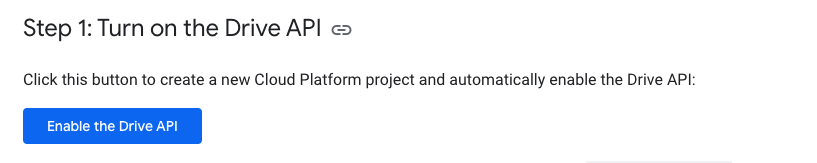
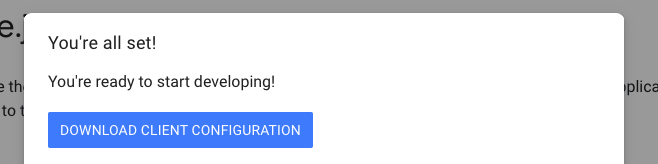

[](https://www.npmjs.com/package/sheets-exporter)

Sheets Exporter - CLI software for automated processing and save data from Google Sheets

## Install

To install `sheets-exporter` you need to install `npm` first

Install _sheets-exporter_:
`npm install -g sheets-exporter`

### Setup credentials

run sheets-exporter

    sheets-exporter

If you have no credentials, you will be promted to get it on:
[https://developers.google.com/drive/api/v3/quickstart/nodejs](https://developers.google.com/drive/api/v3/quickstart/nodejs)

Just enable Google Drive API


And download it to prompted folder (it will write destination in console)
On MacOS it will be `/Users/{Username}/Library/Application Support/sheets-exporter/credentials.json`


You done with credentials!

### Setup token
Run sheets-exporter again

    sheets-exporter

If you have no token, exporter will use his basic config to setup your token. You will be promted to visit URL and give access to your google drive with `quickstart`
Give it on your google account and copy token in console


You done with token!

## Config
There is `config.json` file, main file for check what you need to export. You can make several of it and point needed config in `bash run.sh`. 

Default config file with name `config.json`

Config examples stores in `./config_templates`

Make config file in `/config/config.json`

It's look like:
```js
{
	"sheets":[
	{
		"name": "config", // Name of document
		"type": "csv_web", // Type. Can be "csv_web" or "file"
		"id": "1zMW_3dB73O--rUQ0zLlpco6RcvGNe9x-pN8qC3pqH9w", // If csv_web - id of google sheets document
		"rule": "../config/rules_config.json", // Rules for selected document
		"save": [{
			"dist": "./dist/", // Dist for save
			"format": "lua" // "csv", "lua" or "json"
		}] // Save params, you can point several params to save in different place or formats
	}]
}
```
Rules for document looks like:

Full handlers list see below
```js
{
	"rules": {
		"relics_sets": { // Name of sheet config.
			"parts": ["relics_sets"] // List of google sheets. It is the name of the sheet. You can point several of sheets, but they need to have equal headers (it will merge them)
		},
		"relics_items": {
			"parts": ["relics_items"],
			"type": "list", // By default, csv imported as map, you can export all sheet as a list by add this type
			"handlers": [ // List of how handle your documets
				{
					"type": "union_by", // This one will group by field to map or list
					"config": {
						"field_id": "set_id",
						"list_name": "items",
						"remove_fields": ["id"]
					}
				},
				{
					"type": "add_id_as_field", // Copy key of json record to value
					"config": {
						"id": "set",
						"inner_list": "items"
					}
				}
			]
		},
		"orders": {
			"parts": ["orders"],
			"handlers": [
				{
					"type": "convert_array" // Just make strings like <some, string, 2> to value [some, string, 2]
				}
			]
		}
	}
}
```

### Handlers
General exporter handlers:
- **extract_id**: Make many records from one by splitting it with different fields. Useful for localization
	*params*:
	*example*:
- **add_id_as_field**: Add key of the record to record data
	*params*:
	*example*:
- **union_fields**: Make array from pointed fields
	*params*:
	*example*:
- **union_by**: group records by field. This field will be on upper level of json struct. Can be recursive
	*params*:
	*example*:
- **convert_array**:  Make array from strings like `<26, 36, 42>` to [26, 36, 42]
	*params*:
	*example*:
- **convert_field** Format values by some rules. For example: percents
	*params*:
	*example*:
- **nest_data**: Union pointed fields to json with pointed key
	*params*:
	*example*:
- **set_name**: Add name before all json. It will change json struct. Usually use before saving
	*params*:
	*example*:

#### Last handlers
Should be last, because change the structure of json
- **values_list**: Make a list of values of some field
	*params*:
	*example*:
- **to_list**: Make list instead of dictionary
	*params*:
	*example*:


### TODO:
Custom handlers
Separate configs
More usefull docs and handlers
Make as npm package? For use it as tool with just config folder

### License
MIT License
By Insality

## Issues and suggestions
If you have any issues, questions or suggestions please  [create an issue](https://github.com/Insality/sheets-exporter/issues)  or contact me:  [insality@gmail.com](mailto:insality@gmail.com)

