# About install
The installation time about 5 minutes ⏱️. The Google has changed the way to auth for Google Sheets API. Now you have to create your project to get the access.

# Install
To install **sheets-exporter** use [`npm`](https://docs.npmjs.com/).
```bash
npm install -g sheets-exporter
```
The **sheets-exporter** install globally, so you can access it from anywhere via `sheets-exporter`

# Credentials
*Credentials* - is required to define from which Google project you will get access to your documents. You can share single credentials file across your project. Other users will create their own token, if they have access.

Full instructions you can see here: https://developers.google.com/drive/api/v3/quickstart/nodejs#prerequisites

It's quite massive setup, so you can follow next step-by-step instructions. (Links in the headers - is a source of instructions)

### [Create Project](https://developers.google.com/workspace/guides/create-project#create_a_new_google_cloud_platform_gcp_project)
To use **sheets-exporter**, you need a Google Cloud Platform project. This project forms the basis for creating, enabling, and using all GCP services, including managing APIs.

- Open the  [Google Cloud Console](https://console.cloud.google.com/)
- Press "Select a projects" dropdown button

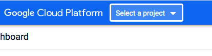

- Press "New project" button

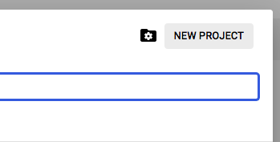

- Enter name of the project (you can use any name)

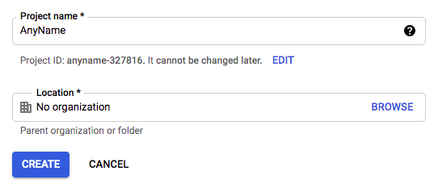

- **Done!**

### [Enable Google Sheets API](https://developers.google.com/workspace/guides/create-project#enable-api)

- Open the  [Google Cloud Console](https://console.cloud.google.com/)

- Open "APIs & Services" menu

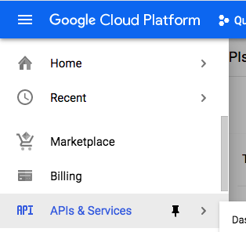

- Press "Enable APIs and Services" button

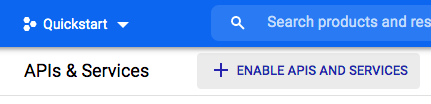

- Search for "Google Sheets" API

- Select Google Sheets API and press "Enable" button

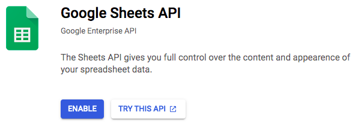

- **Done!**

### [Configure the OAuth consent screen](https://developers.google.com/workspace/guides/create-credentials#configure_the_oauth_consent_screen)
- Open the  [Google Cloud Console](https://console.cloud.google.com/)

- Open "APIs & Services" menu

- Open "OAuth consent screen" menu 

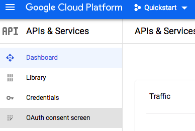

- Select the "external" user type

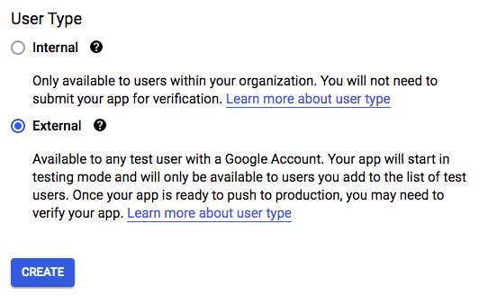

- Fill the App information data (app name, support email, developer email)

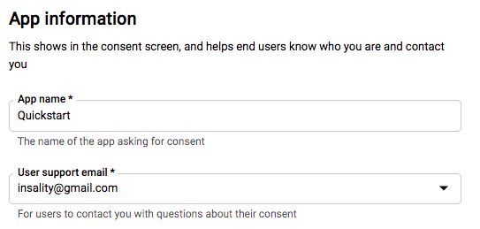

- Press "Save and continue" next two steps (consent and test users)

- Press "Return to dashboard"

- Press "Publish app". It will prompt your, select "Agree". The your project now published and not verified.

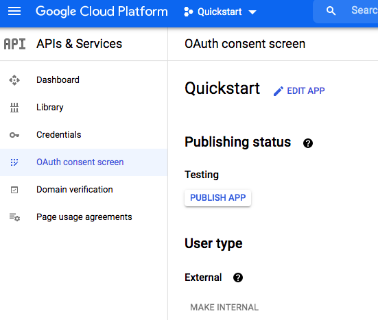

- **Done!**

### [Create a OAuth client ID credentials](https://developers.google.com/workspace/guides/create-credentials#desktop)
- Open the  [Google Cloud Console](https://console.cloud.google.com/)

- Press "Credentials"

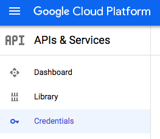

- Press "Create credentials" -> "OAuth client ID"

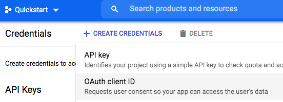

- Select "Desktop app" and enter any name

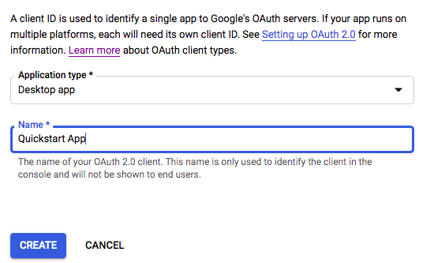

- Download new *credentials.json*

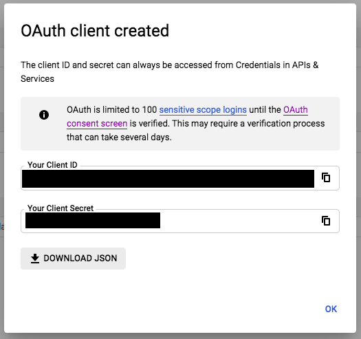

- Save credentials at credentials folder with name `credentials.json`. To see credentials folder use `sheets-exporter setup_credentials`
	- On MacOS path is: `/Users/username/Library/Application Support/sheets-exporter/credentials.json`

- **Done!**


# Token
*Token* - is your client auth token for your project. After credentials setup id done try make your the first export:
```bash
sheets-exporter export
```

If your have no current `token.json`, you will be prompted to web browser to generate your token.
- [Optional] Select your Google account, if prompted

- Google alarm you project is not verified, press "Advanced"

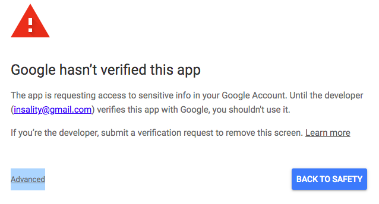

- Press "Go to {appname} (unsafe)"

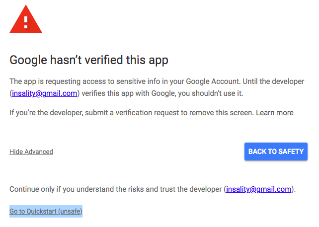

- Give the access to your Google Sheets data (select the checkbox)

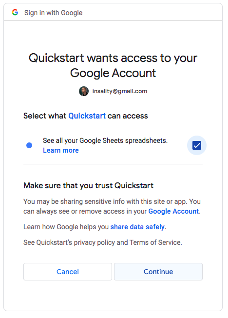

- Copy your token and paste in the command line. The `sheets-exporter export` will prompt you for this.


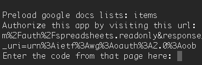

After that the _example export_ will be started. And you can use **sheets-exporter** now with your Google sheets.


