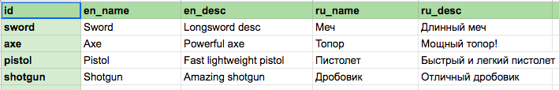

# Handlers

## Handlers list
*Default data handlers, can be used multiple times.*

- **[add_id_as_field](#add_id_as_field)** - Add record key as value in record
- **[array_to_map](#array_to_map)** - Transform array value <v1 v2 v3> to map with specific keys
- **[convert_array](#convert_array)** - Convert record like <16 42> to [14, 62] json array
- **[convert_boolean](#convert_boolean)** - Convert boolean strings to boolean ("true"/"false" strings)
- **[convert_number](#convert_number)** - Convert field to number
- **[convert_string](#convert_string)** - Convert field to string
- **[extract_id](#extract_id)** - Split record on several records. Take fields and add new ids with key postfix
- **[union_data](#union_data)** - Union pointed fields to map or array
- **[only_fields](#only_fields)** - Remove all ids except pointed in records
- **[remove_fields](#remove_fields)** - Remove pointed fields in records
- **[rename_fields](#rename_fields)** - Rename pointed fields in records
- **[to_map](#to_map)** - Convert whole record simple key-value map


## Final Handlers list
*Use this handlers as last handler, because these handlers change the data structure.*

- **[values_list](#values_list)** - Use only key or specific value from records and generate array from it
- **[to_list](#to_list)** - Transform map structure to array structure


## Handlers API

### *convert_number*
*Convert field to number*

**Config fields**:
- **field** - field name to attempt to convert number

**Usage**:
```
{
   "type": "convert_number",
   "config": {
     "field": "type"
	}
}
```

### *convert_boolean*
*Convert boolean strings to boolean ("true"/"false" strings) in the whole record*.

Useful to place in "all_handlers" section in your data configs ([usage example](https://github.com/Insality/defold-eva/blob/master/export_config/config.json#L10)).

**Usage**:
```
{
   "type": "convert_boolean"
}
```

### *convert_array*
*Convert record like <16 42> to [14, 62] json array*.

Useful to place in "all_handlers" section in your data configs ([usage example](https://github.com/Insality/defold-eva/blob/master/export_config/config.json#L10)).

**Usage**:
```
{
   "type": "convert_array"
}
```


### *convert_string*
*Convert field to string*

**Config fields**:
- **field** - field name to ensure it is string type

**Usage**:
```
{
   "type": "convert_string",
   "config": {
     "field": "type"
	}
}
```


### *remove_fields*
*Remove pointed fields in records*

**Config fields**:
- **fields** - array of fields name to remove

**Usage**:
```
{
   "type": "remove_fields",
   "config": {
     "fields": ["id", "check_value"]
	}
}
```


### *rename_fields*
*Rename pointed fields in records*.

**Config fields**:
- **keys** - dictionary, where key is which ID you want to replace with value

**Usage**:
```
{
   "type": "rename_fields",
   "config": {
	   "keys": {
		   "ident_android": "ident",
		   "other_name": "how_to_rename"
	    }
	}
}
```


### *only_fields*
*Remove all ids except pointed in records*.

**Config fields**:
- **ids** - array if required fields

**Usage**:
```
{
   "type": "only_fields",
   "config": {
	   "ids": ["id", "name", "desc"]
	}
}
```


### *add_id_as_field*
*Add record key as value in record*.

**Config fields**:
- **id** - the field name for record id
- **insert_to**[optional] - the map inside record to put the new field

**Usage**:
```
{
   "type": "add_id_as_field",
   "config": {
	   "keys": {
		   "ident_android": "ident"
	    }
	}
}
```

### *array_to_map*
*Transform array value <v1, v2, v3> to map with specific keys*.

**Config fields**:
- **field** - the field name for transform array to map
- **keys** - the array of id names for new map. The array names match 1:1 to field array

**Usage**:
```
{
	"type": "array_to_map",
		"config": {
			"field": "token1",
			"keys": [
				"token_id",
				"amount"
			]
		}
	}
}
```


### *union_data*
*Union pointed fields to map or array*.

**Config fields**:
- **parent_id** - the field_id name to insert new map
- **fields** - the array of fields what should be moved to the new map
- **is_array**[optional] - create array instead of map

**Usage**:
```
{
	"type": "union_data",
		"config": {
			"parent_id": "field_info",
			"fields": [ "color", "damage", "type" ]
		}
	}
}
```


### *extract_id*
*Specific handler. Split record on several records. Take fields and add new ids with key postfix*.
Useful to use it with `separate_fields` saver param to split file by keys to separate files

**Config fields**:
- **keys** - array of map keys for new fields
- **ids** - the map, where key is new postfix for new ids, values is field name to extract
The keys length should be equal to ids value array length

**Usage**:
```
{
	"type": "extract_id",
	"config": {
		"keys": ["en", "ru"],
		"ids": {
			"_name": ["en_name", "ru_name"],
			"_desc": ["en_desc", "ru_desc"]
		}
	}
}
```

**Example**:

_source_:


_result_:
```
{
  "axe_desc": {
    "en": "Powerful axe",
    "ru": "Мощный топор!"
  },
  "axe_name": {
    "en": "Axe",
    "ru": "Топор"
  },
  "pistol_desc": {
    "en": "Fast lightweight pistol",
    "ru": "Быстрый и легкий пистолет"
  },
  "pistol_name": {
    "en": "Pistol",
    "ru": "Пистолет"
  },
  "shotgun_desc": {
    "en": "Amazing shotgun",
    "ru": "Отличный дробовик"
  },
  "shotgun_name": {
    "en": "Shotgun",
    "ru": "Дробовик"
  },
  "sword_desc": {
    "en": "Longsword desc",
    "ru": "Длинный меч"
  },
  "sword_name": {
    "en": "Sword",
    "ru": "Меч"
  }
}
```


## Final Handlers API

### *to_map*
*Convert whole record simple key-value map. (Exporter usually do key-dictionary map)*.

**Config fields**:
- **field** - the field name for make key-value map

**Usage**:
```
{
	"type": "to_map",
		"config": {
			"field": "name"
		}
	}
}
```


### *to_list*
*Remove keys from json, transforming map to array. The each record id will be not saved. Use add_id_as_field before if you want to*.

**Usage**:
```
{
	"type": "to_list"
}
```


### *values_list*
*Return list from value in each record or record key*.

**Config fields**:
- **id** - the field name to make array of values from
- **is_key**[optional] - if true, make array of ids instead of values

**Usage**:
```
{
	"type": "values_list",
	"config": {
		"is_key": true
	}
}
```