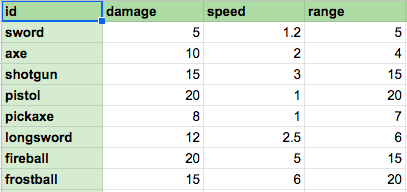
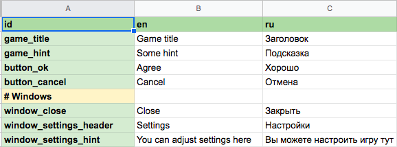

# Export Example

## Default export (no handlers)

**Source:**


**Result:**
```json
{
  "axe": { "damage": 10, "range": 4, "speed": 2 },
  "fireball": {"damage": 20, "range": 15, "speed": 5 },
  "frostball": {"damage": 15, "range": 20, "speed": 6 },
  "longsword": {"damage": 12, "range": 6, "speed": 2.5 },
  "pickaxe": {"damage": 8, "range": 7, "speed": 1 },
  "pistol": {"damage": 20, "range": 20, "speed": 1 },
  "shotgun": {"damage": 15, "range": 15, "speed": 3 },
  "sword": {"damage": 5, "range": 5, "speed": 1.2 }
}
```

## Handler "values list"

**Source:**


**Result:**
```json
[
  "sword", "axe", "shotgun", "pistol", "pickaxe", "longsword", "fireball", "frostball"
]
```

## Separate localization
Save param with _separate_langs_

**Source:**


**Result:**
```json
// File ru.json
{
  "axe_desc": "Мощный топор!",
  "axe_name": "Топор",
  "pistol_desc": "Быстрый и легкий пистолет",
  "pistol_name": "Пистолет",
  "shotgun_desc": "Отличный дробовик",
  "shotgun_name": "Дробовик",
  "sword_desc": "Длинный меч",
  "sword_name": "Меч"
}
```
```json
// File en.json
{
  "axe_desc": "Powerful axe",
  "axe_name": "Axe",
  "pistol_desc": "Fast lightweight pistol",
  "pistol_name": "Pistol",
  "shotgun_desc": "Amazing shotgun",
  "shotgun_name": "Shotgun",
  "sword_desc": "Longsword desc",
  "sword_name": "Sword"
}
```